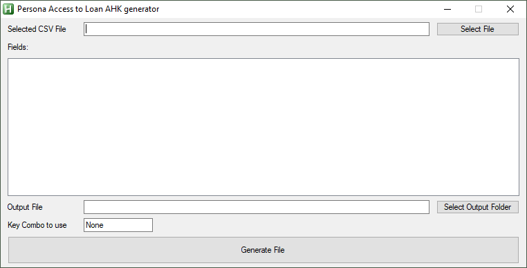
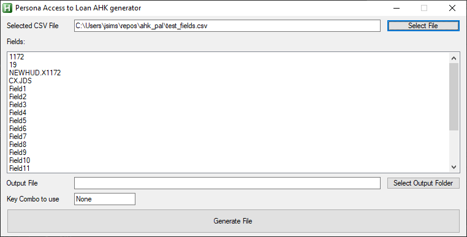
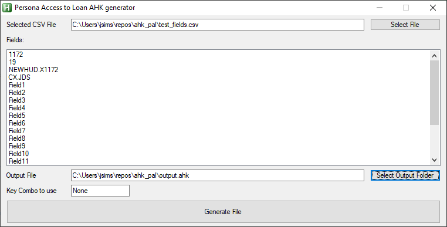
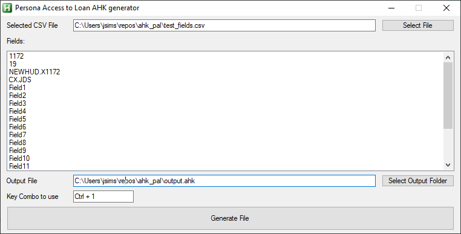

# Persona Access to Loan AutoHotKey generator

## Description

The enc_pal_ahk script takes a list of fields provided in CSV format and creates an AutoHotKey script file that can be used to update the "Fields to Edit" section for a persona that has custom access in a Persona Access to Loans business rule.

## How it works

Below is a screenshot of the script when it is run before any items have been completed:



Use the "Select File" button to select the CSV that contains a one row list (no header) of the fields needing to be setup in the output script. Once the CSV has been selected and the file opened the fields will appears in the "Fields" list box.



Use the "Select Output Folder" to choose a folder and file name. Note that if you choose an already existing AHK file that the script generated will be append to the bottom of that file. If no existing file is selected and a new file name is typed in the file will be created when the "Generate File" button is clicked.



Click in the "Key Combo to use" and press the keys you want to set at the Hot Key combination to assign to the script.



Clicking the "Generate File" button now will now create or append the AHK script with the fields provided. Below is an example of what would be generated:

```ahk
^1::
	Send, 1172{tab}
	Send, 19{tab}
	Send, NEWHUD.X1172{tab}
	Send, CX.JDS{tab}
	Send, Field1{tab}
	Send, Field2{tab}
	Send, Field3{tab}
	Send, Field4{tab}
	Send, Field5{tab}
	Send, Field6{tab}{tab}{space}
	Send, {tab}Field7{tab}
	Send, Field8{tab}
	Send, Field9{tab}
	Send, Field10{tab}
	Send, Field11{tab}
	Send, Field12{tab}
	Send, Field13{tab}
	Send, Field14{tab}
	Send, Field15{tab}
	Send, Field16{tab}{tab}{space}
	Send, {tab}Field17{tab}
	Send, Field18{tab}
	return
```
